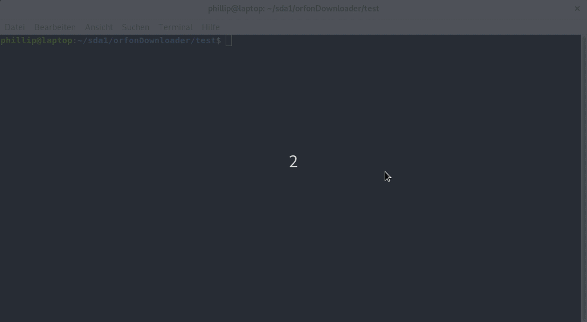

# on.orf.at Downloader

ORF ON Downloader is a cli tool to Download a video from on.orf.at.

## Demonstration

This repository contains code to be used to download videos from ORFs new Video Plattfrom on. It's greatly inspired by [badlogic's](https://github.com/badlogic) [orfondl](https://github.com/badlogic/orfondl)

## Usage

### Synopsis

`  $ orfonDownloader [options...] link1 link2 ...`

### Options

`--help`: To Display the help.

`--chunkSize <Number>`: The amount of HTTP Request to send in parrallel. Use it like: `--chunkSize 20`

`--retries <Number>`: The amount of retries for each HTTP Request. So each HTTP Request will be at most retries + 1 times executed. Use it like: `--retries 3`

`--output <filename>` or `-o <file1,file2,..>`: The name of the files in which to write the final videos. If omitted `final0.mp4`, `final1.mp4` and so on will be used.

`--ffmpegPath <path to ffmpeg binary>`: If your ffmpeg binary isn't part of a directory which is in $PATH the you can use this option. For Example: `--ffmpegPath /bin/ffmpeg`

`--useFFMPEGPipes`: Only available on Linux! This Option can be used to spawn ffmpeg with two pipes as input (one for audio and one for video). With this the intermediate files dont have to be persistent to the Filesystem and usually time is saved